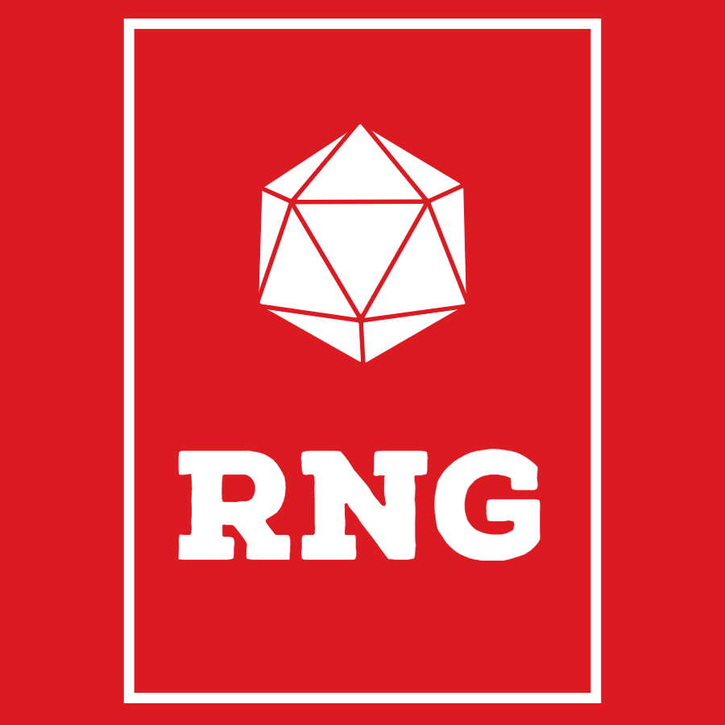

#  Beyond Rng

## Video Description

## Features
Adds a randomiser to the following pages on DNDBeyond
- Spells
- Monsters
- Magic Items
- Feats
- Backgrounds
- Equipment

It also includes the same functionality for homebrew items on the following pages
- Spells
- Monsters
- Magic Items
- Feats
- Backgrounds
- Subclasses
- Races

## Install

[**Chrome** extension]() awaiting release <!-- TODO: Add chrome extension link inside parenthesis -->

## Contribution

Suggestions and pull requests are welcomed!.

## Support
[Buy me a coffee](paypal.me/baindev)

---

This project was bootstrapped with [Chrome Extension CLI](https://github.com/dutiyesh/chrome-extension-cli)

